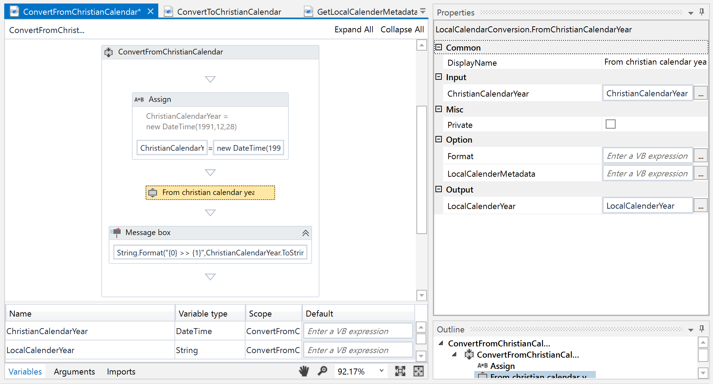
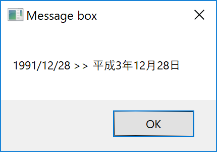
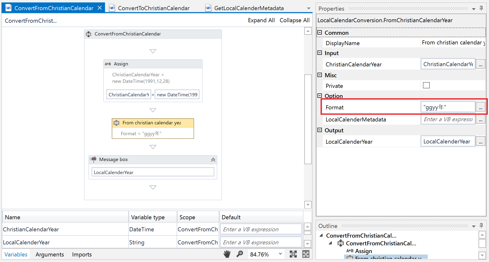
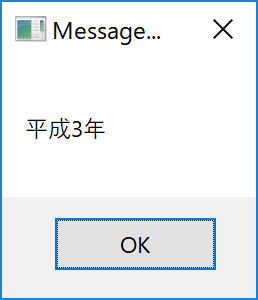
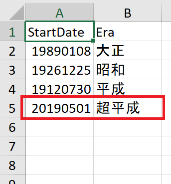
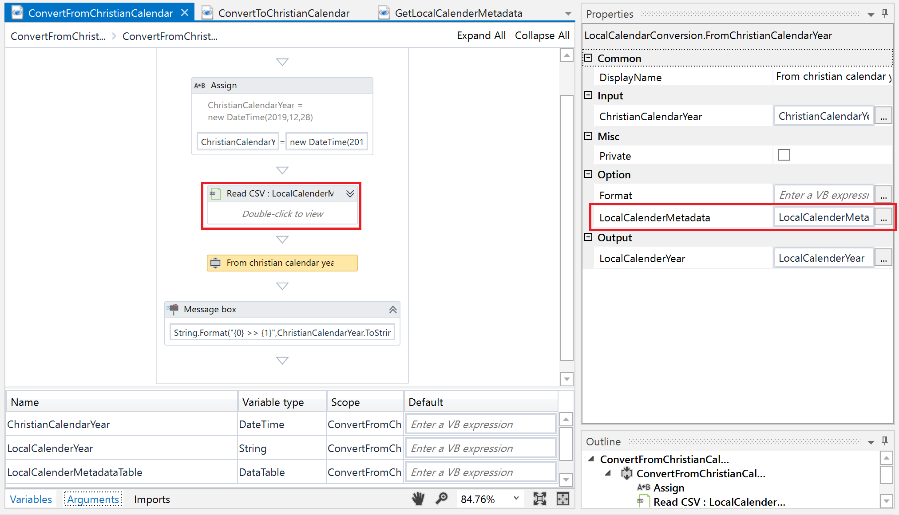
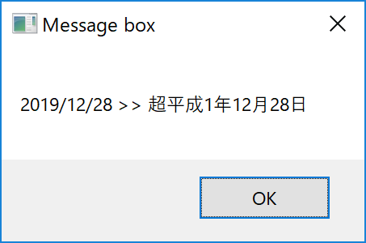
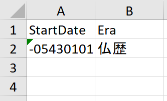
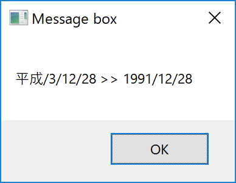

# INSTRUCTION
## Explanation of component

| Activity Name                        | Description                                 |
| ------------------------------------ | ------------------------------------------- |
| Convert From Christian Calendar      | Convert Rocal day, month and year such as Japanese Calender to the Christian calender day, month and year      |
| Convert To Christian Calendar        | Convert Christian calender day, month and year to the Rocal day, month and year such as Japanese Calender     |
| Get Local Calender Metadata Templete | Output CSV Template use for convert Rocal day, month and year |

## How it is meant to function
#### 1.Convert From Christian Calendar
Convert Rocal day, month and year such as Japanese Calender to the Christian calender day, month and year 
`1991年12月28日　→　平成3年12月28日` 
Returns the value in the format set in Option Format. 
`1991年12月28日　→　平成3年　with Format="ggyy年"` 
`1991年12月28日　→　平成　with Format="gg"` 
By default it corresponds to the name of an era from Taisho to Heisei, but you can add a new name of an era as an option. In Japan, a new year begins May 1, 2019, but we can respond to this. 
When Era = "超平成", StartDate = "20190501" is added 
`2019年5月1日　→　超平成1年5月1日`
#### 2.Convert To Christian Calendar
Convert the calendar year to the local year, month, and day such as the Japanese calendar. The input format is gg / yy / MM / dd. (gg = Era, yy = Year, MM = Month, dd = Day) 
`平成/3/12/28　→　1991年12月28日`
#### 3.Get Local Calender Metadata
Output the DataTable template used by Local Calendar Conversion in CSV.

LocalCalenderMetadata.csv
| Era | StartDate |
| ------ | ------ |
| 大正 | 19890108 |
| 昭和 | 19261225 |
| 平成 | 19129730 |

## How it may be applied to other use cases

## Instructions for use
1. Convert from Christian calendar to Japanese calender
    1. Prepare the following sequence and input the year, month, day (DateTime type) in ChristianCalendarYear.
    
    1. The execution result will be December 28, 1991 (String type).
     
2. Change the output format
    1. Prepare the following sequence and input Option: Format = "ggyy year".
        * gg = Era
        * yy = Year
        * MM = Month
        * dd = Day
    
    2. The execution result is Heisei 3 (String type). 
    

3. Convert using local calendar metadata
    1. Add next year of Heisei
        1. Add a new name of an era to LocalCalenderMetadata.csv
        
        2. Read localCalenderMetadata.csv with Read CSV and input Option: LocalCalenderMetadata.
        
        3. The execution result will be December 28, 超平成1 (String type).
        

    2. Changed to Buddhism history
        1. Create metadata CVS. Since the beginning date of Buddha history is BC, it is minus notation.
        
        2. The execution result will be December 28 (String type) of Buddhist calendar 2074.
        

4. Convert Japanese calendar to Christian calendar year
    1. Prepare the following sequence and input the year, month, and day in Japanese calendar in LocalCalenderYear (String type).
    
    2. The execution result will be December 28, 1991 (DateTime type).
     